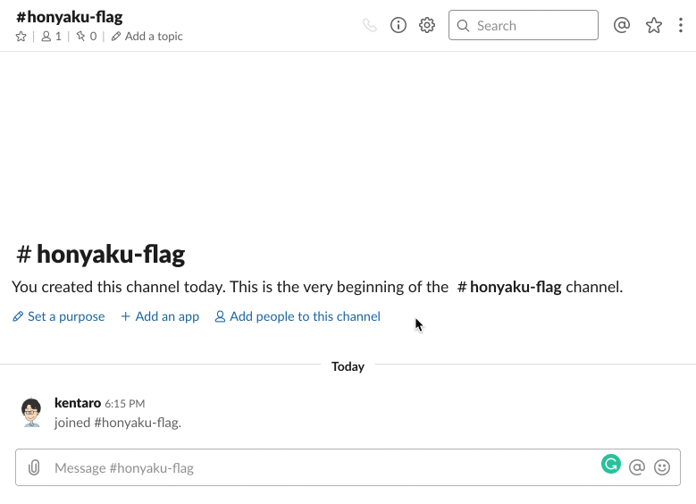

# :triangular_flag_on_post: Honyaku Flag
A Slack app that translates a message when an emoji reaction added to the message. Inspired by [reacjilator](https://github.com/slackapi/reacjilator).

> 

## :tv: Demo


## :robot: Set up the app
1. Create the new app. [Slack API: Applications | Slack](https://api.slack.com/apps)
2. Subscribe to workspace events (Add `reaction_added` event and subscribe url to be notified of events).
3. Add permission scopes by reference to the following list.

  * `channels:history` Access user’s public channels
  * `channels:read` Access information about user’s public channels
  * `reactions:read` Access the workspace’s emoji reaction history

4. Install the app to the workspace and note `OAuth Access Token`, `Bot User OAuth Access Token` and `Signing Secret`.

## :key: Set up credentials
Create the Google Cloud Translation API by reference to the following page.

[Using API Keys  |  Authentication  |  Google Cloud](https://cloud.google.com/docs/authentication/api-keys)

Rename the `.env.example` to `.env` and add credentials.

```
SLACK_BOT_TOKEN=<Bot User OAuth Access Token>
SLACK_OAUTH_TOKEN=<OAuth Access Token>
SLACK_SIGNING_SECRET=<Signing Secret>
TRANSLATION_API_TOKEN=<Google Cloud Translation API Token>
```

## :construction_worker: Develop

### Subscribe locally events from Slack
Set up to subscribe locally events by reference to the following page.

[Using ngrok to develop locally for Slack | Slack](https://api.slack.com/tutorials/tunneling-with-ngrok)

Add the URL of `Forwarding` to `Request URL` with Event Subscriptions page in Slack (Concatenate the URL of `Forwarding` to the path `/slack/events`. e.g. `https://foobar.ngrok.io/slack/events`).

```bash
$ ngrok http 3000
ngrok by @inconshreveable                                       (Ctrl+C to quit)

Session Status                online
Session Expires               7 hours, 47 minutes
Update                        update available (version 2.3.34, Ctrl-U to update
Version                       2.2.8
Region                        United States (us)
Web Interface                 http://127.0.0.1:4040
Forwarding                    http://foobar.ngrok.io -> localhost:3000
Forwarding                    https://foobar.ngrok.io -> localhost:3000
```

### Run the app
```bash
$ npm install
$ npm run dev
```

## :rocket: Deploy
WIP

## :memo: LICENSE
MIT
